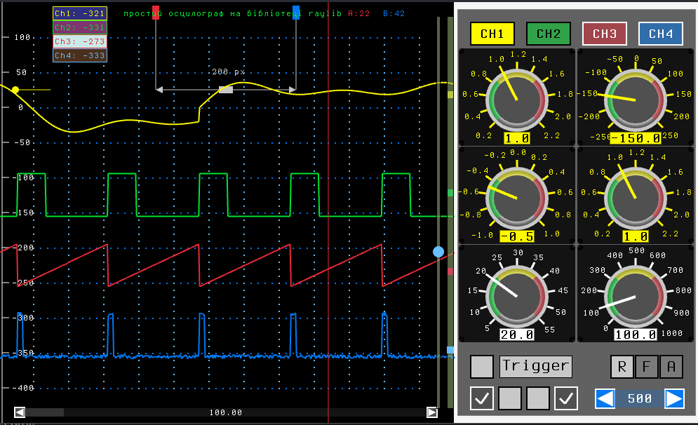

# simple_pc_oscilloscope

Простий осцилограф для ПК на базі бібліотеки Raylib. Як джерело сигналу використовується STM32 "Bluepill".

## Можливості

- Відображення чотирьох каналів сигналу з мікроконтролера
- Підтримка тригерів, масштабування та зміщення сигналу
- Підтримка кирилиці в інтерфейсі
- Графічний інтерфейс на Raylib

## Як зібрати

1. Встановіть бібліотеку [Raylib](https://www.raylib.com/) для вашої ОС.
2. Клонуйте репозиторій:
3. Зберіть проект:

## Збірка проекту

Для збірки проекту використовуйте Makefile.

Просто виконайте команду в корені проекту:

Це скомпілює всі необхідні файли і створить виконуваний файл (наприклад, `oscilloscope`).

---

Якщо потрібно почистити скомпільовані файли, виконайте:
Makefile clean

4. Підключіть пристрій STM32 через USB.

## Як користуватися

- Виберіть COM-порт у панелі керування.
- Натисніть "Connect" для підключення.
- Налаштуйте масштаб, зміщення та тригер для кожного каналу.
- Для виходу натисніть `ESC`.

## Залежності

- [Raylib](https://www.raylib.com/)
- [rs232](https://github.com/WinterMute/rs232) (для роботи з COM-портом)

---

### Вимоги

- Встановлений компілятор GCC або сумісний
- Бібліотека raylib (та інші залежності, якщо є)

## Автор

[Alex2269](https://github.com/Alex2269)

# simple_pc_oscilloscope

A simple PC oscilloscope based on the Raylib library. Uses STM32 "Bluepill" as a signal source.

## Features

- Displays four signal channels from microcontroller
- Trigger, scaling and offset support
- Cyrillic support in GUI
- Graphical interface using Raylib

## Build instructions

1. Install [Raylib](https://www.raylib.com/) for your OS.
2. Clone the repository:
3. Build the project:
4. Connect your STM32 device via USB.

## Usage

- Select the COM port in the control panel.
- Click "Connect" to start.
- Adjust scaling, offset, and trigger for each channel.
- Press `ESC` to exit.

## Dependencies

- [Raylib](https://www.raylib.com/)
- [rs232](https://github.com/WinterMute/rs232) (for COM-port communication)

## Author

[Alex2269](https://github.com/Alex2269)
